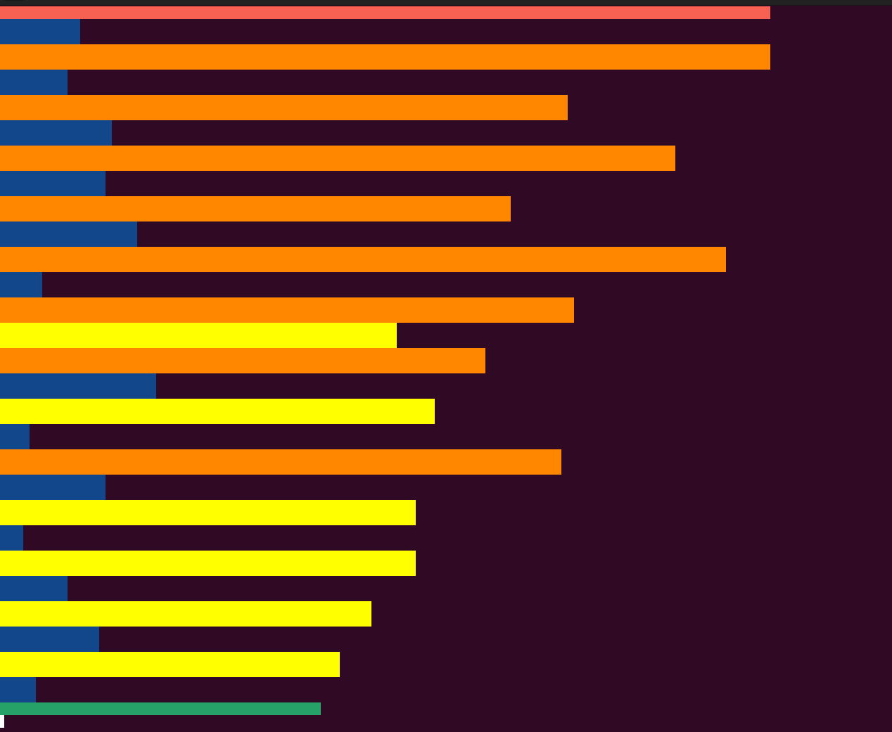

# Python-Mic-Volume-Capture

Code to monitor loudness
* It captures the mic input and determines the input volume level, and displays as a bar chart, for example to monitor the noise level in the room.
* This was a simple poc to capture how the level of noise coming from a room

Note: 
--------
* Running this in the built in terminal e.g. Pycharm will not produce the colored barchart.
* This has only been tested on Ubuntu Linux.

According to the GNU General Public License, any modifications made to this code must be openly shared. Therefore, we require that all changes be submitted via a pull request to ensure they benefit the entire community and comply with the GPL's requirements.
========================================

The following need to be installed.
========================================
* pip install -r requirements.txt

or run:
--------
* sudo apt-get install python3-pip  
* pip install colored   
* pip install numpy  
* sudo apt-get update -y  
* sudo apt-get install -y libportaudio2  
* pip install sounddevice 

 

Screen-shot of sound being measured and displayed in terminal.

## Some additional features that I will more than likely never get to

### Bandwidth Throttling
**Feature**: Dynamically adjust the internet bandwidth of devices such as gaming consoles or computers based on detected noise levels. Excessive noise can lead to reduced internet speed, affecting online gaming and streaming.

**Implementation**: This feature would require integration with your smart home router via its API to manage bandwidth settings. A separate service could be developed to facilitate communication between the noise monitoring system and the router.

### IoT Annoying Alarm
**Feature**: Activate a loud and annoying alarm when noise exceeds a predetermined threshold, serving as a noise deterrent.

**Implementation**: Utilize an IoT platform like Arduino or Raspberry Pi equipped with a loud siren or buzzer that can be remotely activated from the main application over Wi-Fi.

### Lights and Visual Cues
**Feature**: Utilize smart lights to provide visual feedback on noise levels—red for too loud, yellow for caution, and green for acceptable levels.

**Implementation**: Connect to smart home systems such as Philips Hue or other Wi-Fi-enabled lighting solutions to adjust the lights based on the noise level.

### Silence Rewards System
**Feature**: Implement a system where children can earn points for maintaining low noise levels during designated hours. Points could be exchanged for privileges like extra internet time or other rewards.

**Implementation**: Develop a mobile app or a web-based dashboard where both parents and children can track points and rewards. Points are accrued by maintaining lower noise levels, logged and calculated through a simple database system.

### Smart TV Integration
**Feature**: Automatically adjust the volume or pause a TV or game console if the surrounding noise exceeds a certain level.

**Implementation**: This feature requires integration with smart TVs or media centers either through infrared signals or network commands, depending on device compatibility.

### Voice Alerts
**Feature**: Use a text-to-speech system to issue verbal warnings through smart speakers when the noise level is too high.

**Implementation**: Use existing smart speakers connected to your network to deliver pre-set verbal messages when high noise levels are detected.

### Privacy Considerations
Ensure all household members are informed about how the system works and its purpose to manage expectations and privacy concerns effectively.
